# Containerizing a Simple Node.js Application with Docker

## Introduction
In an era where rapid software deployment is essential, mastering containerization techniques is a significant asset for developers. This project focuses on the process of containerizing a straightforward Node.js application using Docker, a powerful tool that revolutionizes application deployment and management. By utilizing Docker, I aimed to create an easily portable and scalable application, emphasizing my capability to apply modern development methodologies that are vital for today’s cloud-centric applications.

## Objective:

The primary objective of this project is to containerize a simple Node.js application to enhance its portability and deployment efficiency across various environments using Docker.

**Specific objectives include:**

- **Develop a Simple Node.js Application:** Initialize a Node.js project, add dependencies, and create server code that responds to HTTP requests.
- **Create a Dockerfile:** Define the container environment by writing a Dockerfile that specifies the base image, working directory, dependencies, and application commands.
- **Build and Run Docker Container:** Build a Docker image from the Dockerfile and run the application in a Docker container, ensuring that it can be accessed from a web browser.
- **Push the Docker Image to Docker Hub:** Make the Docker image publicly available by pushing it to Docker Hub, allowing others to easily pull and run the application.

**Tools and Technologies:**

- **Node.js:** Backend framework for building the application.
- **Docker:** Tool for creating, deploying, and running applications within containers.
- **Dockerfile:** A text file used to define the container environment for the application.

## **Step 1:** Creating a Simple Node.js Application

1. Initialize the Project: `npm init -y`

    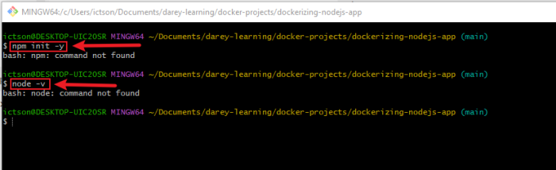

    The error message bash: `npm: command not found`indicates that the npm (Node Package Manager) command is not recognized in my terminal, which typically means that Node.js is not installed or not properly configured in my system's PATH. 

### **Solution Steps**

To resolve this issue, I followed a systematic approach:

**Solution Step 1:** Check Node.js Installation

- I verified if Node.js was installed by running `node -v`. If the command returned a version number, Node.js was installed; if not, it confirmed that it was missing.

    

**Solution Step 2:** Install Node.js

- I downloaded the latest LTS version of Node.js from the official website and ensured that the option to add it to the system's PATH was selected during installation.

    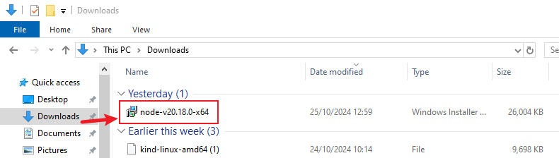

**Solution Step 3:** Verify Installation
- After installation, I opened a new terminal and checked the versions of Node.js and npm using `node -v` and `npm -v`. Both commands returned valid version numbers.

    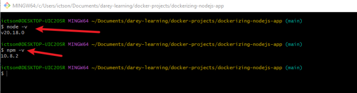

**Solution Step 4:** Retry npm Command

1. With Node.js and npm verified, I navigated back to my project directory and successfully executed `npm init -y`, generating a `package.json` file.

    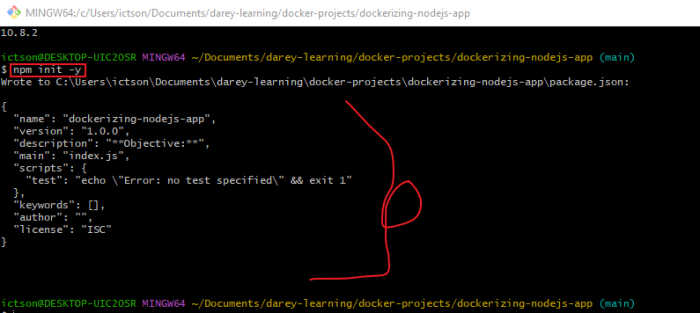

2. Add Dependencies

- I added `express` as a dependency:

    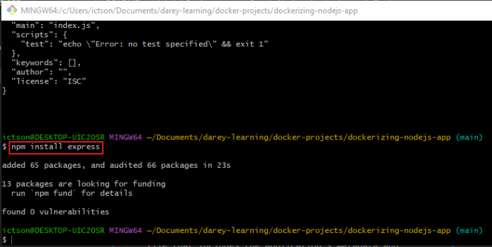

    **Explanation:** Express is a lightweight framework for building web applications in Node.js. We use it here to create a basic web server.

3. Write the Server Code

    - I created an `index.js` file with the following content:

        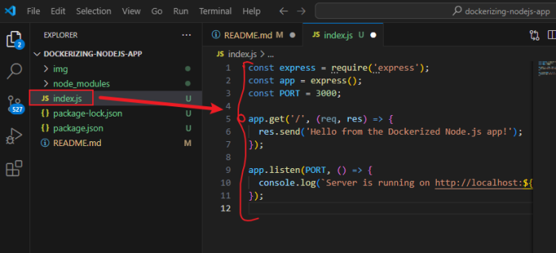
    
        **Explanation:** This code sets up a simple server that responds with **"Hello from the Dockerized Node.js app!"** when accessed at the root URL.

## **Step 2:** Creating the Dockerfile

1. Create a Dockerfile

    - In the project root, I will create a file named Dockerfile (no extension).
    - Here’s the content of the Dockerfile:

        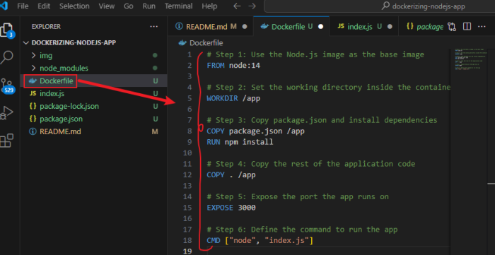

    **Explanation of Each Step:**

    - `FROM node:14:` Specifies the base image as Node.js (version 14).
    - `WORKDIR /app:` Sets /app as the working directory within the container.
    - `COPY package.json /app:` Copies package.json to the working directory.
    - `RUN npm install:` Installs dependencies.
    - `COPY . /app:` Copies the rest of the application files.
    - `EXPOSE 3000:` Exposes port 3000 to allow connections to the container.
    - `CMD ["node", "index.js"]:` Sets the default command to start the server.

## **Step 3:** Building the Docker Image

1. Build the Image

    - I will Run the following command: `docker build -t nodejs-app .`

        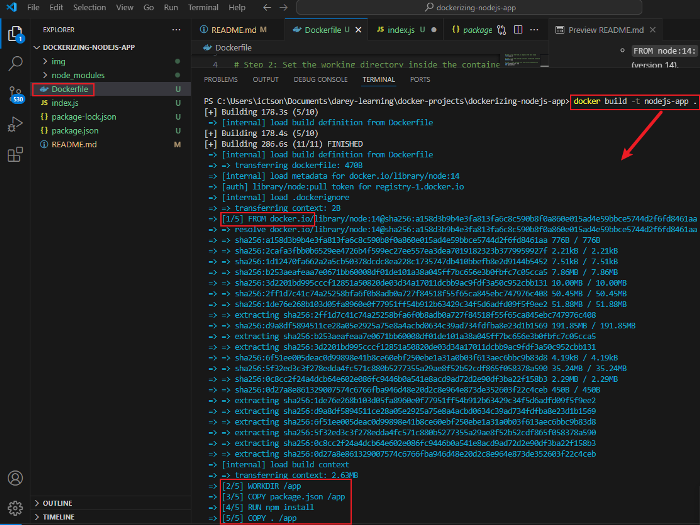

        **Explanation:** The `-t` flag names the image nodejs-app. The . specifies the current directory as the build context.

## **Step 4:** Running the Container

1. Here I will start the Container

    - Run the container using: `docker run -p 3000:3000 nodejs-app` then run `docker ps -l` to list the running container.

        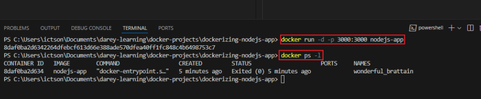

        **Explanation:**

        - `-p 3000:3000:` Maps the host machine’s port 3000 to the container’s port 3000.
        - `nodejs-app:` Specifies the image name.

2. Access the Application

    - Here I will open a web browser and go to http://localhost:3000.

        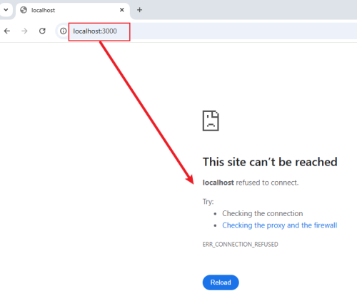

        My browser did not display the message after navigating to http://localhost:3000. Here's what I did to solve the problem:

    - I opened my `index.js` and `Dockerfile` files and changed the ports to 3001.

        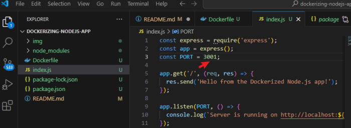

        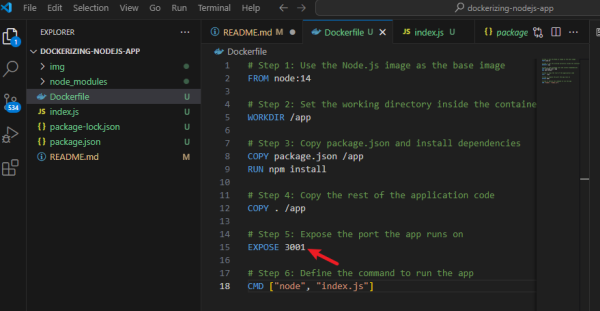

    - Then, I rebuilt the Docker image:

        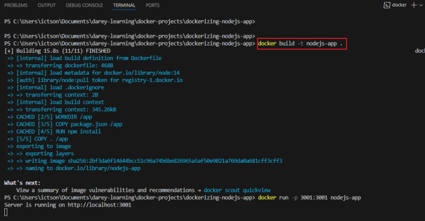

    - I ran the container with the following command:

        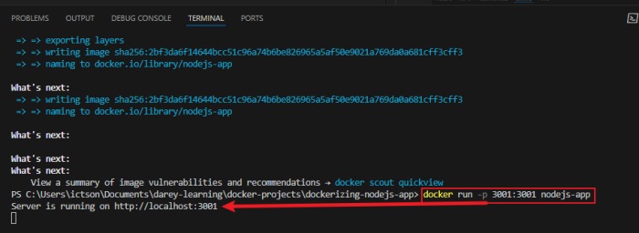

    Finally, I opened my browser and navigated to http://localhost:3001, and it displayed the message successfully.

    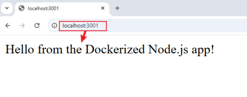

## **Step 5:** Push the Docker Image to Docker Hub

In this step, I will push the Docker image to Docker Hub so that it can be accessed from anywhere.

**Explanation:**

Docker Hub is a cloud-based registry where you can store and share Docker images. By pushing your image to Docker Hub, you make it accessible to other machines or users who want to pull and run your containerized application.

- **STEP 1:** Log in to Docker Hub

    

- **STEP 2:** Tag the Docker Image
    - Use the following command to tag the image: `docker tag nodejs-app <your-dockerhub-username>/nodejs-app:latest`
    - Replace `<your-dockerhub-username>` with your Docker Hub username.

    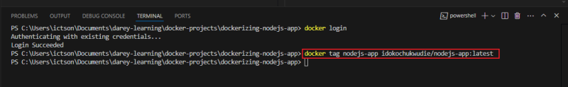

- **STEP 3:** Push the Image to Docker Hub

    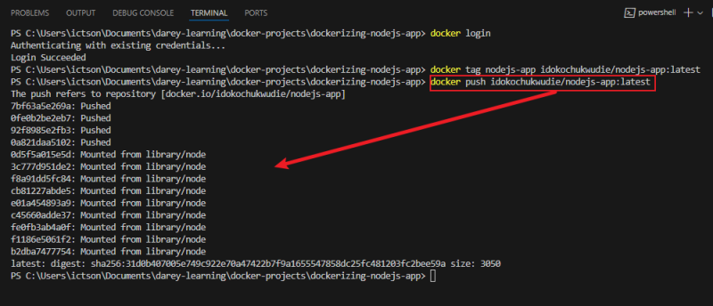

- **STEP 4:** Verify the Image on Docker Hub

    - I will log in to my Docker Hub account using a web browser and navigate to my profile. There, you can see the nodejs-app repository with the latest tag.

    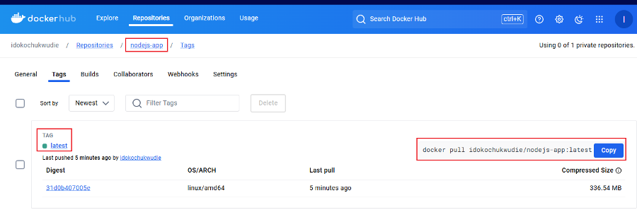

## Usage:

- Now that the image is pushed to Docker Hub, anyone with Docker installed can pull the image using: `docker pull <your-dockerhub-username>/nodejs-app:latest`

- They can then run the container with: `docker run -p 3001:3001 <your-dockerhub-username>/nodejs-app:latest`

## Conclusion
The successful containerization of the `Node.js` application using Docker not only showcases my technical expertise but also reflects my dedication to leveraging industry best practices in software development. Through this project, I gained practical experience in deploying applications within containers, positioning myself to address the challenges of a fast-evolving technological landscape. I am eager to apply these skills in future roles that prioritize innovation and effective software delivery.